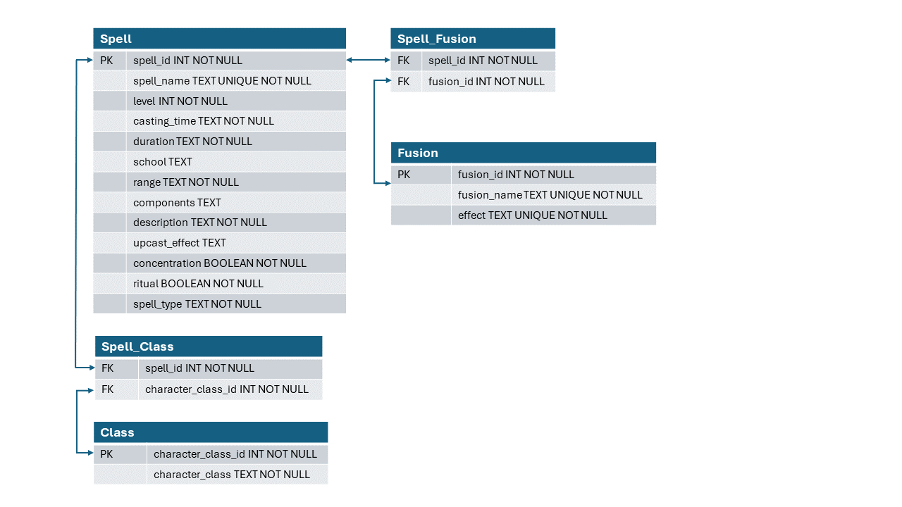

# 5e Spell Combo Tool
This tool is a database with an API for querying and adding custom 5e spells. The spells intended to be added to the database are standard, XYZ, Fusion, and Link spells. Rather than adding Synchro spells (it wouldn't make sense since it's just fancy upcasting), you can use querying to find Synchro compatible spells and Accel Synchro targets.

## Database Schema

### Justifications

Each table has had a carefully considered reason for existing. Some variables are expected to change as new spellcasting methods or added, the existing systems are improved, or I just think of a more helpful way to organize the tables.

#### Spell

Most variables in the Spell table have redundancy but do not show a problematic many-to-many relationship like which class spell lists that a spell belongs to. This needs a table for itself, otherwise we'd need a list within a variable. I am still undecided if I'm happy with the "has_upcast_effect" variable or if I should replace that with the upcast effect, remove the "NOT NULL" constraint, and pull the upcast effect out of the descripton. 

There are a few fields that could be standardized but the utility of doing so would not be high at all. For example, the casting times which are equivalent to 1 reaction all have a trigger condition. The condition could be pulled out and given its own variable but for the functionality of the database, the LIKE function works just fine to look for the "1 Reaction" substring.

#### Class

The class spell lists that a spell belongs to is usually a list. This requires a junction table to avoid having a list within a variable.

#### Fusion

Fusion spells require at least 2 different spells as their components. Many-to-many relationship that requires a junction table.

## Supported Extra Deck spellcasting Methods
The following spellcasting methods are supported by the database.

### Synchro Spellcasting

To Synchro Cast on their turn, the user consumes 1 leveled spell slot of level X in addition to casting a spell of a level of Y, then increases that spell’s level by Y. For example, a 5th level mage casts the spell Fireball at 3rd level and consumes a 2nd-level spell slot to increase Fireball’s cast level to 5, which would normally be unobtainable at that mage’s level. The conditions for a Synchro cast are below:
1. The user must have the ability to cast spells innately.
2. The user must have both hands-free meaning that they cannot carry a shield. At most, they can hold an arcane focus, wand, or staff.
3. The user must have a number of sorcery points equal to the level of the spell they wish to cast.
4. The user also consumes their bonus action.
If one performs a Synchro Cast, they cannot use any other sorcery points that turn (besides for use of Empowered Spell).

To perform any type of Synchro Cast, a mage redirects the energy of their spell slots by moving their hands in a circle while consuming the lower-leveled spell, creating an emerald ring of light, then pushing the energy of the higher-leveled spell outward.

In addition to the benefits of casting a spell that one would otherwise be unable to cast, the spell’s power tends to be enhanced.
#### Accelerated Synchro Spellcasting (A.K.A. Accel Synchro)
In addition to the conditions needed for a normal Synchro Spellcast, the user must also follow these conditions:
1. The spells cast must be in the same school.
2. If one performs an Accel Cast, they cannot use any other sorcery points that turn (besides for use of Empowered Spell).

The sequence of an Accel Casting is simple in concept but extremely difficult to execute. There are 3 main routes: either their spell was just counterspelled, they attempted it as a reaction, or they’re using it as the main action.

1. **Counterspell route**: If their spell was successfully counterspelled by an opponent, they can Synchro Cast as a bonus action. This allows the caster to reabsorb the spell's energy, then as part of the same spellcasting move, they consume another leveled spell slot to cast a spell of a higher level. For example, if a level 5 Sorcerer casts Magic Missile, a 1st level Evocation spell, that is counterspelled, they can reabsorb that energy and consume a level 3 spell slot and 4 Sorcery points to cast the 4th Level Evocation spell Ice Storm.
2. **Reaction route**: If the user is attempting to cast a spell as a reaction, they can perform an Accel Cast as normal with extra conditions in addition to the ones listed above:
   - The user cannot cast 2 spells in order to Accel Cast; instead, they must use a spell that either has a duration that they are currently maintaining or it must be a Concentration spell. In either case, the spell’s effects are then ended in favor of the Accel Casting.
   - The spell they are Accel Casting must have a casting time of a reaction.
For example, if a mage has the 1st-level spell Mage Armor active, they can consume a 2nd-level spell slot and 3 sorcery points to cast Counterspell. This type of Accel Casting is fairly limited as many higher-level spells do not have a casting time of a reaction. Its main purpose is to provide a means of Counterspelling as a last resort by consuming a spell they have active in favor of preventing a bigger threat created by an enemy’s spellcasting.
3. **Main Action Route**: This version is very similar to the reaction route, in which they use a spell that either has a duration they have already cast or a Concentration spell. However, the main differentiation is that there is no limitation on the casting time.

### Fusion Spellcasting

1. When fusing two or more spells, the duration will typically be that of the shortest spell.
2. For instantaneous spells, you can use your main action to cast the first spell for no effect, then use polymerization with a bonus action to retroactively fuse it.
3. Cantrips count as a 1st level spell for the purposes of sorcery point cost.

#### What Fusion spells can I use?

1. **Polymerization** (1st lvl, Transmutation, 1 bonus action, Self, V, S, M (at least 2 spells), Instantaneous): You attempt to fuse 2 or more spells in order to create a more powerful version that combines their aspects in some way. If you consume a number of sorcery points equal to the total level of both spells, you can use Polymerization without having to actually cast the spells. Both spell slots are consumed as if you had cast them.
2. **Super Polymerization** (4th lvl, Transmutation, 1 action or reaction, Self, V, S, M (at least 2 spells), Instantaneous): You fuse 2 or more spells in order to create a more powerful version that combines their aspects in some way. Both spell slots are consumed as if you had cast them. You may also use spells that your opponent is currently casting or has already cast whose effects remain. No one may attempt to interrupt the casting of this spell.

### XYZ Spellcasting

XYZ spells have Ranks instead of Levels. If you run them this way, they can't be Counterspelled and are unaffected by Dispel Magic. You can instead still consider them to be Levels. For the sake of simplicity, they will be shown as Levels in the database and is left as a user decision to choose to run them as Ranks instead.

1. The user must have the ability to cast spells innately.
2. The user must have both hands-free meaning that they cannot carry a shield. At most, they can hold an arcane focus, wand, or staff. 
3. The user must have a number of sorcery points equal to the rank of the spell they wish to cast.
4. The user also consumes their bonus action.
5. If one performs an XYZ Cast, they cannot use any other sorcery points that turn (besides for use of Empowered Spell).

To perform any type of XYZ Cast, a mage overlays the energy of their spell slots by moving their hands in a swirling motion, creating a golden-colored galaxy between them. The spell then exits the galaxy as it is cast.

At 5th level, you can further tap into your inner wellspring of power to “overlay” your same leveled spells and create “rank” spells. To cast XYZ spells, you must spend sorcery points to “overlay” existing spell slots to cast a spell with a rank equal to the level of the spells used to cast it. These XYZ spells then stay out on the battlefield as continuous effects, but with “overlay materials” that offer extra effects that can be detached as a reaction. Once an XYZ spell has used up all its material, it ceases to function and is dispelled. Unless otherwise stated, all XYZ spells require at least 2 spells of equivalent level, do not require concentration, and last for up to 1 hour.

#### What kind of XYZ spells can I use?

XYZ spell creation is entirely up to GM discretion. Try to keep in mind what spells your PC would typically use or if they have a theme going on. As they would probably use something similar to those spells, or create something that fits the PC's character arc.

#### Kite’s XYZ Spells
1. Rank 1 spells
   - **Starlight Blessing**: A hole in space opens above the caster’s head, revealing a beautiful, starry nebula. While this spell still has overlay materials, you may reroll one attack roll per turn. You may not know the result of the first attack roll and must take the second roll. As a reaction, you may detach one overlay material to make an opponent reroll an attack roll before the result is declared.
   - **XYZ Armor**: There appears to be no obvious visible effect unless further investigated with Detect Magic. While this spell still has overlay materials, your AC equals 14 + your Charisma modifier + your Dexterity modifier. As a reaction, you can detach one material: for the rest of the turn, you gain +5 AC and resistance to bludgeoning, slashing, and piercing damage. This XYZ spell lasts for 24 hours. 
   - **Numeron Dragon**: A majestic golden dragon floats above the caster, ready to unleash his wrath upon his enemies. May also use 2 preexisting XYZ spells of equal rank and 2 Sorcery points as material to cast. Has no passive effect. As an action, you can detach one material: deal radiant damage to one creature you can see within 60 feet of you equal to the total rank of all XYZ spells currently on the field * 10. At the end of your next turn, if this spell has no more material, cast the spell Antimagic Field on yourself, with a range of 60 feet and a duration of 1 round. 
   - **Big Bang Blast**: A large galaxy appears over the caster, but as time goes on it draws in on itself more and more until it becomes merely a small pocket of energy. When it reaches a certain size, it detonates. Must have all other spell slots be used up in the creation of XYZ spells. All overlay spells must deal damage in some way or form, and can also be cast using any 2 or more spells of the same level. When cast, target up to 5 targets. Each target is then marked with a galaxy. At the end of your turn, detach one material. When all overlay materials are used up, deal average damage of all overlay spells used to all targets as radiant damage. 
2. Rank 2 spells
   - **Photon Force**: Your body shimmers with the light of a star. While this spell still has overlay materials, gain advantage on all attack rolls while you are not within 5 feet of any enemy. As a reaction, you can detach a material and force an opponent to make a Strength saving throw. On a failure, they are pushed 30 feet away from you.
3. Rank 3 spells
   - **Quazar Cannon**: A brilliant bright light floats above the caster, almost as if it is a window into Heaven itself. While this spell still has overlay materials, it raises the light level within 30 feet to bright light. As an action, you may detach one material: Fire one blast of intense light to one creature within 60 ft, dealing 10d6 radiant damage on a successful hit.
4. Rank 4 spells
   - **Utopia Planitia**: Wings that contain magnificent constellations form on your back. Carrying the strength of a gamma burst, ready to protect you. While this spell still has overlay materials, any time you declare any type of attack, your opponent’s AC becomes 10 until the end of your turn. As a reaction, you may detach one material: negate one attack being made against you.
5. Rank 5 spells
   - **Solar Flare**: Wisps of what looks like flames erupt from the caster with intense power. While this spell still has overlay materials, everyone within 15 ft takes fire damage equal to your level at the start of your turn. As an action, you may detach one material: Fire one flare at one creature within 60 ft, they are afflicted with the same effects of being in an antimagic field for the rest of the round and take 8d6 fire damage. 
6. Rank 6 spells
   - **Galaxy Dragon**: A brilliant blue dragon with the eyes of a galaxy floats above the caster, ready to protect him from any incoming attack. May also use a preexisting XYZ spell of rank 2 and 2 Sorcery points as material to cast. This spell has no passive ability. When an enemy casts a spell, as a reaction, you may detach one material: Galaxy Dragon steals the spell from them and you can cast it instead using their spell slot but with your statistics.
7. Rank 7 spells
   - **Void Vacuum**: A dark energy surrounds you, pulling enemies into its foul embrace. May also use a preexisting XYZ spell of rank 3 and 3 Sorcery points as material to cast. While this spell still has overlay materials, it pulls everyone towards you (5ft per turn). This movement cannot be resisted. In order to move away from you, your enemies must make a Strength saving throw. When enemies are within 15 ft of you, deal 2d10 necrotic damage each round. As an action, you may detach one material: target one creature and have them make a Strength saving throw. On a failure, they are pulled within 5 ft of you and are dealt double necrotic damage for that round.
8. Rank 8 spells
   - **Graviton Force**: A large transparent sphere appears around the caster, making even floating leaves crash to the ground with more force than natural. May also use a preexisting XYZ spell of rank 4 and 4 Sorcery points as material to cast. While this spell has material, any enemy within 30 feet of you must make a Strength saving throw in order to move, take an action, or take a reaction. As an action, you may detach one material and spend 1 Sorcery point: immediately after, XYZ cast a spell of rank 3 or lower with a material of 1. 
9. Rank 9 spells
   - **Around the World**: A galaxy forms around you. You are the axis of its creation, the feeling of the planet's rotations fills you with great power. A power in which you can redirect others’ powers for your own. May also use a preexisting XYZ spell of rank 5 and 5 Sorcery points as material to cast. While this spell has material, any battle damage done to you is negated and instead inflicted on the one dealing the damage. As a reaction, you can detach one material and target one opponent: negate the effects of any magic spells or items that they currently have active on them for 1 hour. As an action, you can detach one material: cast the spell Time Stop with an additional base round.
   - **The True King of all Calamities**: A large spectral dragon hovers over you, its very presence terrifying those who oppose the caster. May also use a preexisting XYZ spell of rank 5 and 5 Sorcery points as material to cast. While this spell has material, your enemies cannot regain hit points. As a reaction, you may detach one material: until the beginning of your next turn, your enemies may not cast spells targeting or attack you or your allies.

### Link Spellcasting

Link spells have Link Ratings instead of Levels. If you run them this way, they can't be Counterspelled and are unaffected by Dispel Magic. You can instead consider them to be Levels. For the sake of simplicity, they will be shown as Levels in the database and is left as a user decision to choose to run them as Link Ratings instead.

1. You must be at minimum a level 11 spellcaster.
2. You must have at minimum 13 Intelligence.
3. You must have both hands free meaning that they cannot carry a shield. At most, they can hold an arcane focus, wand, or staff.
4. After a spell resolves or ends, it can be repurposed as material for a Link spell.
5. A spell can’t be reabsorbed if it deals maximum damage.
6. A spell can’t be reabsorbed if it is a cantrip.
7. You can only store an amount of reabsorbed spells up to your PB.
8. All stored spells are lost on a Long Rest.
9. A Link spell’s effect can be reused, and lasts for as many minutes as its Link rating.
10. You can only cast each Link spell once per Rest.

To perform Link spellcasting, the caster summons a portal with empty magical circuit slots using their focus in one hand, and with the other hand, sends the saved spell energy into the corresponding circuits. The effect of this completed circuit manifests as a construct emerging from the portal.

#### What kind of Link spells can I use?

Link spells take a vast amount of resources to develop since the circuit pattern is unique to every Link spell, and require a vast amount of trial and error. Creating a Link spell should be made as a way to improve spellcasting efficiency, not necessarily to create new spells.

1. Link 2 spells
   - **Verte Anaconda**: As an action, Link 2 spells. You can spend ¼ of your max HP to cast any “Fusion” or “Polymerization” spell instead of consuming a spell slot.
   - **Chris-chan Halqifibrax**: As an action, Link 1 synchro spell and 1 other spell. When you Synchro cast, you can tune the spell without expending a spell slot if the upcast is 3 levels or lower. As a reaction, you can dispel this Link spell and immediately Synchro cast any spell without expending any resources.
   - **Electrumite**: As an action, Link 2 pendulum cast spells. When you Link cast this spell, recover a spell slot used during the pendulum scaling. As an action, you can reabsorb one of your already-set pendulum scales, then cast a spell of the same level as the scale you just absorbed using sorcery points. Then, you can change the scale at no cost, then take another action to pendulum cast only 1 spell.
   - **I:P Masquerena**: As an action reaction, Link 2 non-Link spells. As a reaction, tThis Link spell can be used as Link material before the end of its duration. A Link spell that uses this spell as Link material can’t be counterspelled or dispelled and is immune to anti-magic fields.
   - **Ahashina**: As an action, Link 2 spells that were the same level. When you XYZ cast a spell that uses 2 materials and is the same rank as the level of the linked spells, the XYZ spell requires only 1 spell slot and the associated number of sorcery points. If you XYZ spellcast while this Link spell is active, target one creature within 60 feet: cast Fireball on them as a free action. 

## Unsupported Extra Deck Spellcasting Methods

Pendulum spellcasting and Delve spellcasting are unsupported since Delve spellcasting only relies on spell slots and has no dependencies on other spells. This could later be changed if they are confirmed to have levels and maybe an associated spell school. XYZ would be in a similar situation but has an associated Link spell, and have Ranks which are similar enough to Levels. Pendulum spellcasting is just a matter of knowing the associated rules. It does not require keeping track of any new spells.

### Pendulum Spellcasting

1. The user must have the ability to cast spells innately.
2. The user must have both hands-free meaning that they cannot carry a shield. At most, they can hold an arcane focus, wand, or staff.
3. The user must have a number of sorcery points equal to the level of the spell they wish to cast.
4. The user does not consume their bonus action, however, the user can only use their bonus action to XYZ, Synchro, or Fusion cast.
5. The user can use other sorcery points, but only to perform the other spellcasting methods.
6. Pendulum scales last until the end of the encounter.
7. The concentration limit still applies.
8. All spells resolve simultaneously.

To perform any type of Pendulum Cast, a mage sets the Pendulum scales by consuming 2 different leveled spell slots, then casts their hand to the sky as the magical energy swings between these 2 visible spells. The energy then exits the resulting hole in space, casting the spells the mage wishes to cast. To Pendulum cast, one must consume a level of sorcery points equal to the total levels of the spells they are casting simultaneously, and they can only cast a number of spells equal to their proficiency bonus.

### Delve Casting

1. The user must have the ability to cast spells innately.
2. The user must have a number of sorcery points (or equivalent) equal to the highest spell level used at the time of casting.
3. The user must have both their magic focus and a 5 ft. cube of space for the item they are infusing. 
4. The user loses one spell slot that is within 2 levels of the highest spell slot cast to perform the Ritual. The spell slot is unusable until the Delve spell is expended/lost.
5. Items infused by Delve casting may hold the magic for a maximum of 1 week.
6. The user must spend at least 1 hour casting this spell.
7. Delve casting requires at least one item.
8. One other caster may assist you in Delve casting, and split the costs. Any creature assisting in the casting must have access to the spell slots needed to cast, even if they are not using said slots. Some spells require enough resources that 2 casters are required in order for it to be cast.

To cast a Delve spell, the user will require their magic focus as well as an item to focus your magical energy on. You, the object, and the area around you glows with a mist-like magical energy. During this process, the user(s) slowly release(es) their magic energy over time, allowing them to create new spells using multiple spell slots. The user maintains the magic of the spell by having the item slowly drain energy from the user, hence the locked off spell slot.
