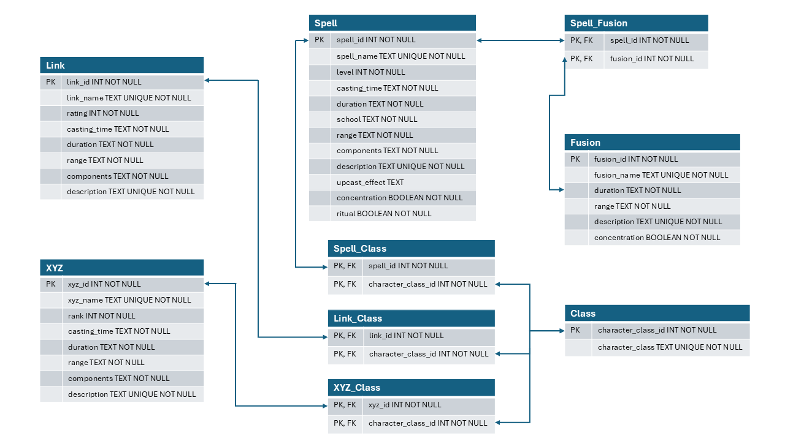

# 5e Spell Combo Tool
This tool is a database with an API for querying and adding custom 5e spells. The spells intended to be added to the database are standard, [XYZ](#xyz-spellcasting), [Fusion](#fusion-spellcasting), and [Link](#link-spellcasting) spells. Rather than adding [Synchro](#synchro-spellcasting) spells (it wouldn't make sense since it's just fancy upcasting), you can use querying to find Synchro compatible spells and [Accel Synchro](#accelerated-synchro-spellcasting-aka-accel-synchro) targets.

- [5e Spell Combo Tool](#5e-spell-combo-tool)
- [Dependencies](#dependencies)
  - [Polars Version](#polars-version)
  - [Pandas Version](#pandas-version)
- [Supported Extra Deck spellcasting Methods](#supported-extra-deck-spellcasting-methods)
  - [Synchro Spellcasting](#synchro-spellcasting)
    - [Accelerated Synchro Spellcasting (A.K.A. Accel Synchro)](#accelerated-synchro-spellcasting-aka-accel-synchro)
  - [Fusion Spellcasting](#fusion-spellcasting)
    - [What Fusion spells can I use?](#what-fusion-spells-can-i-use)
  - [XYZ Spellcasting](#xyz-spellcasting)
    - [What kind of XYZ spells can I use?](#what-kind-of-xyz-spells-can-i-use)
    - [Kite’s XYZ Spells](#kites-xyz-spells)
  - [Link Spellcasting](#link-spellcasting)
    - [What kind of Link spells can I use?](#what-kind-of-link-spells-can-i-use)
    - [Aleister's Link Spells](#aleisters-link-spells)
- [Adding Your Own Spells](#adding-your-own-spells)
  - [Fusion](#fusion)
  - [XYZ](#xyz)
  - [Link](#link)
- [Database Schema](#database-schema)
- [Notice of SRD 5.1 Content](#notice-of-srd-51-content)

# Dependencies

## Polars Version
- python
- polars
- adbc-driver-sqlite
- pyarrow-core

## Pandas Version
- python
- pandas

# Supported Extra Deck spellcasting Methods
The following spellcasting methods are supported by the database. These mechanics were made with the [gestalt rules](https://www.dandwiki.com/wiki/Gestalt_(5e_Variant_Rule)) for 5e in mind. Any reference to sorcery points can be substitued with a class resource per DM discretion.

## Synchro Spellcasting

To Synchro Cast on their turn, the user consumes 1 leveled spell slot of level X in addition to consuming a spell slot of level Y, then increases that spell’s level by Y. For example, a 5th level mage casts the spell Fireball at 3rd level and consumes a 2nd level spell slot to increase Fireball’s cast level to 5, which would normally be unobtainable at that mage’s level. The conditions for a Synchro cast are below:

1. The user must have the ability to cast spells innately.
2. The user must have both hands-free meaning that they cannot carry a shield. At most, they can hold an arcane focus, wand, or staff.
3. The user must have a number of sorcery points equal to the level of the spell they wish to cast.
4. The user also consumes their Bonus Action.

If one performs a Synchro Cast, they cannot use any other sorcery points that turn (besides for use of Empowered Spell). There are no class restrictions on Synchro spellcasting.

To perform any type of Synchro Cast, a mage redirects the energy of their spell slots by moving their hands in a circle while consuming the lower-leveled spell, creating an emerald ring of light, then pushing the energy of the higher-leveled spell outward.

In addition to the benefits of casting a spell that one would otherwise be unable to cast, the spell’s power tends to be enhanced.

### Accelerated Synchro Spellcasting (A.K.A. Accel Synchro)

In addition to the conditions needed for a normal Synchro Spellcast, the user must also follow these conditions:

1. The spells cast must be in the same school.
2. If one performs an Accel Cast, they cannot use any other sorcery points that turn (besides for use of Empowered Spell).

The sequence of an Accel Casting is simple in concept but extremely difficult to execute. There are 3 main routes: either their spell was just counterspelled, they attempted it as a Reaction, or they’re using it as the main Action.

1. **Counterspelled route**: If their spell was successfully counterspelled by an opponent, they can Synchro Cast as a Bonus Action. This allows the caster to reabsorb the spell's energy, then as part of the same spellcasting move, they consume another leveled spell slot to cast a spell of a higher level. For example, if a level 5 Sorcerer casts Magic Missile, a 1st level Evocation spell, that is counterspelled, they can reabsorb that energy and consume a level 3 spell slot and 4 Sorcery points to cast the 4th Level Evocation spell Ice Storm.
2. **Reaction route**: If the user is attempting to cast a spell as a reaction, they can perform an Accel Cast as normal with extra conditions in addition to the ones listed above:
   - The user cannot cast 2 spells in order to Accel Cast; instead, they must use a spell that either has a duration that they are currently maintaining or it must be a Concentration spell. In either case, the spell’s effects are then ended in favor of the Accel Casting.
   - The spell they are Accel Casting must have a casting time of a Reaction.
For example, if a mage has the 1st-level spell Mage Armor active, they can consume a 2nd-level spell slot and 3 sorcery points to cast Counterspell. This type of Accel Casting is fairly limited as many higher-level spells do not have a casting time of a reaction. Its main purpose is to provide a means of Counterspelling as a last resort by consuming a spell they have active in favor of preventing a bigger threat created by an enemy’s spellcasting.
3. **Main Action Route**: This version is very similar to the reaction route, in which they use a spell that either has a duration they have already cast or a Concentration spell. However, the main differentiation is that there is no limitation on the casting time.

## Fusion Spellcasting

1. Fusion spells are available on spontaneous caster spell lists (sorcerers, bards, rangers, warlocks).
2. The combination of spells should produce a novel effect rather than gluing the spell effects together.
3. The creation of Fusion spells should be reviewed by the DM.
4. When fusing two or more spells, the duration will typically be that of the shortest spell.
5. For instantaneous spells, you can use your main Action to cast the first spell for no effect, then use Polymerization with a Bonus Action to retroactively fuse it.
6. Cantrips count as a 1st level spell for the purposes of sorcery point cost.
7. Link and XYZ spells can't be used as Fusion material.
8. Using an upcasted spell as Fusion material does not make the Fusion inherit the upcast effect.

### What Fusion spells can I use?

1. **Polymerization** (1st lvl, Transmutation, Bonus Action, Self, V, S, M (at least 2 spells), Instantaneous): You attempt to fuse 2 or more spells in order to create a more powerful version that combines their aspects in some way. If you consume a number of sorcery points equal to the total level of both spells, you can use Polymerization without having to actually cast the spells. Both spell slots are consumed as if you had cast them.
2. **Super Polymerization** (4th lvl, Transmutation, Action or Reaction, Self, V, S, M (at least 2 spells), Instantaneous): You fuse 2 or more spells in order to create a more powerful version that combines their aspects in some way. Both spell slots are consumed as if you had cast them. You may also use spells that your opponent is currently casting or has already cast whose effects remain. No one may attempt to interrupt the casting of this spell.

## XYZ Spellcasting

XYZ spells have Ranks instead of Levels. If you run them this way, they can't be Counterspelled and are unaffected by Dispel Magic. You can instead still consider them as Levels in your own campaign.

1. The user must have at least one level in a class that can cast 9th level spells.
2. The user must have the ability to cast spells innately.
3. The user must have both hands-free meaning that they cannot carry a shield. At most, they can hold an arcane focus, wand, or staff. 
4. The user must have a number of sorcery points equal to the Rank of the spell they wish to cast.
5. The user also consumes their Bonus Action.
6. If one performs an XYZ Cast, they cannot use any other sorcery points that turn (besides for use of Empowered Spell).

To perform any type of XYZ Cast, a mage overlays the energy of their spell slots by moving their hands in a swirling motion, creating a golden-colored galaxy between them. The spell then exits the galaxy as it is cast.

At 5th level, you can further tap into your inner wellspring of power to "overlay" your same leveled spells and create "Rank" spells. To cast XYZ spells, you must spend sorcery points to "overlay" existing spell slots to cast a spell with a rank equal to the level of the spells used to cast it. These XYZ spells then stay out on the battlefield as continuous effects, but with "overlay materials" that offer extra effects that can be detached as a reaction. Once an XYZ spell has used up all its material, it ceases to function and is dispelled. Unless otherwise stated, all XYZ spells require at least 2 spells of equivalent level, do not require concentration, last for up to 1 hour, and can't be a Ritual spell.

### What kind of XYZ spells can I use?

XYZ spell creation is entirely up to GM discretion. Try to keep in mind what spells your PC would typically use or if they have a theme going on as they would probably use something similar to those spells, or create something that fits the PC's character arc.

### Kite’s XYZ Spells
1. Rank 1 spells
   - **Starlight Blessing**: A hole in space opens above the caster’s head, revealing a beautiful, starry nebula. While this spell has overlay materials, you may reroll one attack roll per turn. You may not know the result of the first attack roll and must take the second roll. As a Reaction, you can detach one overlay material to make an opponent reroll an attack roll before the result is declared.
   - **XYZ Armor**: There appears to be no obvious visible effect unless further investigated with Detect Magic. While this spell has overlay materials, your base AC becomes 14 + your Charisma modifier + your Dexterity modifier. As a Reaction, you can detach one material: for the rest of the turn, you gain +5 AC and resistance to bludgeoning, slashing, and piercing damage. XYZ Armor lasts for 24 hours.
   - **Numeron Dragon**: May also use 2 preexisting XYZ spells of equal rank and 2 sorcery points as material to cast. A majestic golden dragon floats above the caster, ready to unleash his wrath upon his enemies. Numeron Dragon is not dispelled when it no longer has materials. As an Action, you can detach one material: deal radiant damage to one creature you can see within 60 Ft. of you equal to the total rank of all XYZ spells currently on the field * 10. At the end of your next turn, if this spell has no more material, cast the spell Antimagic Field on yourself with a range of 60 Ft. and a duration of 1 round. Numeron Dragon is dispelled when the Antimagic Field ends.
   - **Big Bang Blast**: A large galaxy appears over the caster, but as time goes on it draws in on itself more and more until it becomes merely a small pocket of energy. When it reaches a certain size, it detonates. Must have all other spell slots be used up in the creation of XYZ spells. All overlay spells must deal damage in some way, and can also be cast using any 2 or more spells of the same level. When cast, target up to 5 targets. Each target is then marked with a galaxy. At the end of your turn, detach one material. When all overlay materials are used up, deal average damage of all overlay spells used to all targets as radiant damage.
2. Rank 2 spells
   - **Photon Force**: Your body shimmers with the light of a star. While this spell has overlay materials, gain advantage on all attack rolls while you are not within 5 Ft. of any enemy. As a Reaction, you can detach a material and force an opponent to make a Strength saving throw. On a failure, they are pushed 30 feet away from you.
3. Rank 3 spells
   - **Quazar Cannon**: A brilliant bright light floats above the caster, almost as if it is a window into Heaven itself. While this spell has overlay materials, it raises the light level within 30 Ft. to bright light. As an Action, you can detach one material: make a ranged spell attack to fire one blast of intense light at one creature within 60 Ft., dealing 10d6 radiant damage on a successful hit.
4. Rank 4 spells
   - **Utopia Planitia**: Wings that contain magnificent constellations form on your back carrying the strength of a gamma burst, ready to protect you. While this spell has overlay materials, any time you declare an attack your opponent’s AC becomes 10 until the end of your turn. As a Reaction, you can detach one material: negate one attack being made against you.
5. Rank 5 spells
   - **Solar Flare**: Wisps of what looks like flames erupt from the caster with intense power. While this spell still has overlay materials, creatures within 15 Ft. takes fire damage equal to your level at the start of your turn. As an Action, you may detach one material: fire one flare at a creature within 60 Ft., they are afflicted with the same effects of being in an Antimagic Field until the start of your next turn and take 8d6 fire damage.
6. Rank 6 spells
   - **Galaxy Dragon**: May also use a preexisting XYZ spell of rank 2 and 2 Sorcery points as material to cast. A brilliant blue dragon with the eyes of a galaxy floats above the caster, ready to protect him from any incoming attack. As a Reaction, when an enemy casts a spell you can detach one material: Galaxy Dragon steals the spell from them and you can cast it instead using their spell slot but with your statistics.
7. Rank 7 spells
   - **Void Vacuum**: May also use a preexisting XYZ spell of rank 3 and 3 Sorcery points as material to cast. A dark energy surrounds you, pulling enemies into its foul embrace. While this spell has overlay materials, it pulls all creatures within 30 Ft. towards you (5 Ft. per turn). This movement cannot be resisted. In order to move away from you, hostile creatures must make a Strength saving throw. Hostile creatures within 15 Ft. of you are dealt 2d10 necrotic damage at the start of your turn. As an Action, you may detach one material: target one creature to make a Strength saving throw. On a failure, they are pulled within 5 Ft. of you and are dealt double necrotic damage until the start of your next turn.
8. Rank 8 spells
   - **Graviton Force**: May also use a preexisting XYZ spell of rank 4 and 4 Sorcery points as material to cast. A large transparent sphere appears around the caster, making even floating leaves crash to the ground with more force than is natural. While this spell has overlay materials, any enemy within 30 Ft. of you must make a Strength saving throw in order to move, use an Action, Bonus Action, or Reaction. As an Action, you can detach one material and spend 1 Sorcery point: immediately after, XYZ cast a spell of rank 3 or lower with 1 material.
9. Rank 9 spells
   - **Around the World**: May also use a preexisting XYZ spell of rank 5 and 5 Sorcery points as material to cast. A galaxy forms around you. You are the axis of its creation, the feeling of the planet's rotations fills you with great power. A power in which you can redirect others’ powers for your own. While this spell has overlay materials, any battle damage done to you is negated and instead inflicted on the one dealing the damage. As a Reaction, you can detach one material and target one creature: negate the effects of any magic spells or items that they currently have active on them for 1 Hr. As an Action, you can detach one material: cast the spell Time Stop with an additional base round.
   - **The True King of all Calamities**: May also use a preexisting XYZ spell of rank 5 and 5 Sorcery points as material to cast. A large spectral dragon hovers over you, its very presence terrifying those who oppose the caster. While this spell has overlay materials, hostile creatures cannot regain hit points. As a Reaction, you can detach one material: until the beginning of your next turn, hostile creatures can not target you or your allies with spells or attacks.

## Link Spellcasting

Link spells have Link Ratings instead of Levels. If you run them this way, they can't be Counterspelled and are unaffected by Dispel Magic. You can instead consider them to be Levels. For the sake of simplicity, they will be shown as Levels in the database and is left as a user decision to choose to run them as Link Ratings instead.

1. You must be at minimum a level 11 spellcaster.
2. You must have at minimum 13 Intelligence.
3. You must have both hands free meaning that they cannot carry a shield. At most, they can hold an arcane focus, wand, or staff.
4. After a spell resolves or ends, it can be repurposed as material for a Link spell.
5. A spell can’t be reabsorbed if it deals maximum damage.
6. A spell can’t be reabsorbed if it is a cantrip.
7. You can only store an amount of reabsorbed spells up to your PB.
8. All stored spells are lost on a Long Rest.
9. A Link spell’s effect can be reused, and lasts for as many minutes as its Link rating.
10. You can only cast each Link spell once per Rest.

To perform Link spellcasting, the caster summons a portal with empty magical circuit slots using their focus in one hand, and with the other hand, sends the saved spell energy into the corresponding circuits. The effect of this completed circuit manifests as a construct emerging from the portal.

### What kind of Link spells can I use?

Link spells take a vast amount of resources to develop since the circuit pattern is unique to every Link spell, and require a vast amount of trial and error. Creating a Link spell should be made as a way to improve spellcasting efficiency, not necessarily to create new spells.

### Aleister's Link Spells

1. Link 2 spells
   - **Verte Anaconda**: As an Action, Link 2 spells. You can spend an amount of hit points equal to 1/4 of your max hit points to cast any "Fusion" or "Polymerization" spell instead of consuming a spell slot.
   - **Halqifibrax**: As an Action, Link 1 Synchro spell and 1 other spell. When you Synchro spellcast, you can tune the spell without expending a spell slot if the upcast is 3 levels or lower. As a Reaction, you can dispel Halqifibrax and immediately Synchro spellcast any spell without expending any resources.
   - **Electrumite**: As an Action, Link 2 Pendulum cast spells. When you cast Electrumite, recover a spell slot used during the Pendulum scaling. As an Action, you can reabsorb one of your already-set Pendulum scales, then cast a spell of the same level as the scale you just absorbed using sorcery points. Then, you can change the scale at no cost and take another Action to Pendulum cast 1 spell.
   - **I:P Masquerena**: As an Action, Link 2 non-Link spells. As a Reaction, you can dispel I:P Masquerena and immediately Link spellcast, using I:P Masquerena as Link material. A Link spell that uses I:P Masquerena as material is unaffected by Dispel Magic, Counterspell, and Antimagic Fields.
   - **Ahashina**: As an Action, Link 2 spells that were the same level. When you XYZ cast a spell that requires exactly 2 spell slots as overlay materials and is the same rank as the level of the Linked spells, the XYZ spell requires only 1 spell slot and the associated number of sorcery points. If you XYZ spellcast while this Link spell is active, you can target one creature within 60 feet: cast Fireball on that creature 

# Adding Your Own Spells
The following tables will serve as a guide for how you should format each spell type before you add it to the database.

## Fusion

## XYZ

## Link

# Database Schema

# Notice of SRD 5.1 Content
This work includes material taken from the System Reference Document 5.1 (“SRD 5.1”) by Wizards of the Coast LLC and available at https://dnd.wizards.com/resources/systems-reference-document. The SRD 5.1 is licensed under the Creative Commons Attribution 4.0 International License available at https://creativecommons.org/licenses/by/4.0/legalcode.